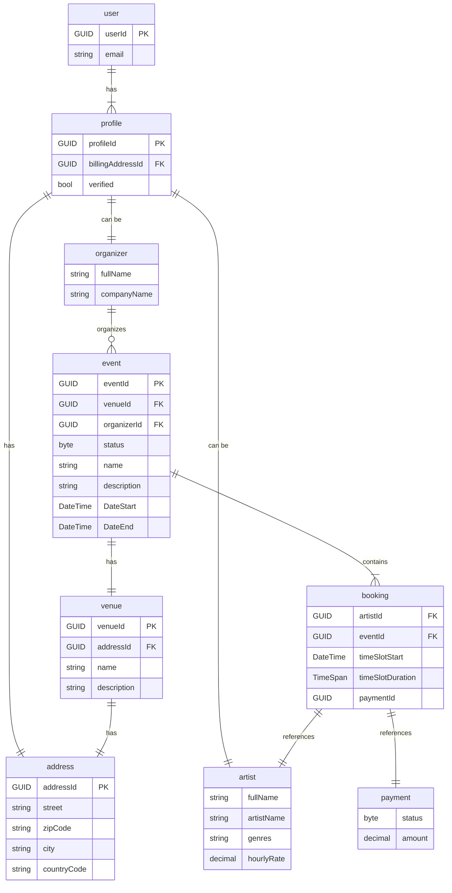

```mermaid
erDiagram
    user {
        GUID userId PK
        string email
    }

    profile {
        GUID profileId PK
        GUID billingAddressId FK
        bool verified
    }

    address {
        GUID addressId PK
        string street
        string zipCode
        string city
        string countryCode
    }

    profile ||--|| address : "has"
    user ||--|{ profile : "has"

    artist {
        string fullName
        string artistName
        string genres
        decimal hourlyRate
    }

    organizer {
        string fullName
        string companyName
    }

    profile ||--|| artist : "can be"
    profile ||--|| organizer : "can be"

    event {
        GUID eventId PK
        GUID venueId FK
        GUID organizerId FK
        byte status
        string name
        string description
        DateTime DateStart
        DateTime DateEnd
    }

    organizer ||--o{ event : "organizes"

    venue {
        GUID venueId PK
        GUID addressId FK
        string name
        string description
    }

    venue ||--|| address : "has"
    event ||--|| venue : "has"

    booking {
        GUID artistId FK
        GUID eventId FK
        DateTime timeSlotStart
        TimeSpan timeSlotDuration
        GUID paymentId
    }

    event ||--|{ booking : "contains"
    booking ||--|| artist : "references"

    payment {
        byte status
        decimal amount
    }

    booking ||--|| payment: "references"
```
