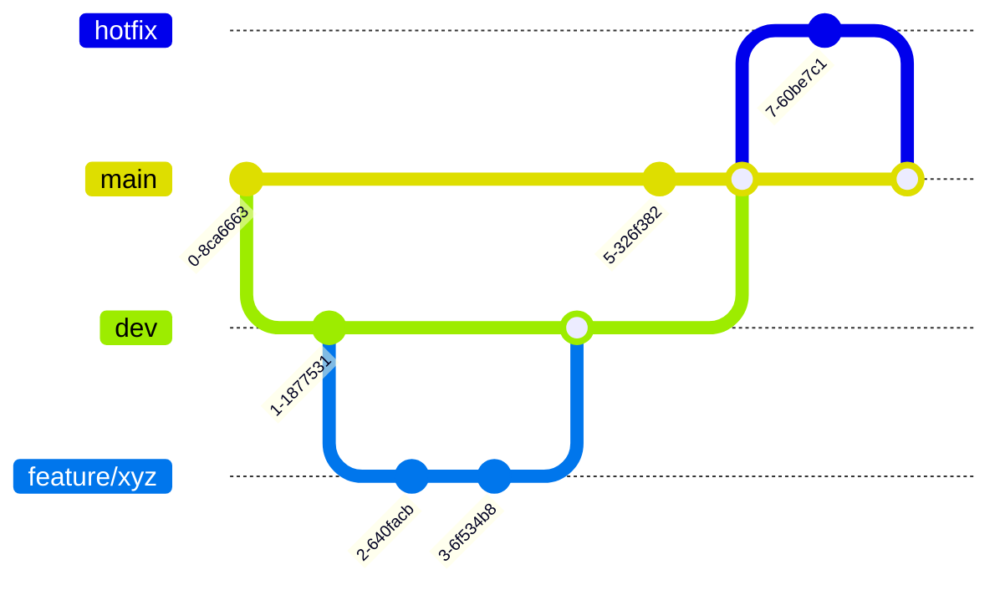

# Branching

The development within this repository will follow the strategy described within this file.

## Branches

The `main` branch is continuously deployed to the **production** environment.
Contributions to `main` may only occur through pull requests from `dev`.

The `dev` branch is continuously deployed to the **test** environment.
Contributions to `dev` may only occur through pull requests from `feature`.

A `hotfix` branch may be used to directly contribute a hotfix to the `main` branch and thus the **production environment**.

A `feature` branch must be used whenever contributing a new feature. When the feature is ready, it should be merged into the `dev` via a pull request.

